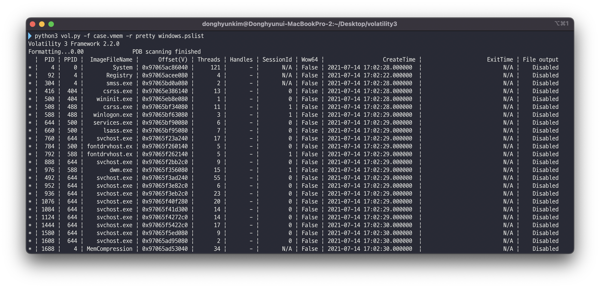

<p align='center'></p>
<h1 align="center">Volatility 3</a></h1>
<p align="center">
  <em>The volatile memory extraction framework</em>
</p>
<p align="center">
    <a href="https://github.com/volatilityfoundation/volatility3/actions/workflows/build-pypi.yml">
        
    </a>
    <a href="https://volatility3.readthedocs.io/en/latest/">
        
    </a>
    <a href="https://github.com/volatilityfoundation/volatility3/releases">
        
    </a>
    
    <a href="https://twitter.com/volatility">
        
    </a>
    </p>
<p align="center">

</p>

Volatility is the world's most widely used framework for extracting digital
artifacts from volatile memory (RAM) samples. The extraction techniques are
performed completely independent of the system being investigated but offer
visibility into the runtime state of the system. The framework is intended
to introduce people to the techniques and complexities associated with
extracting digital artifacts from volatile memory samples and provide a
platform for further work into this exciting area of research.

In 2019, the Volatility Foundation released a complete rewrite of the
framework, Volatility 3. The project was intended to address many of the
technical and performance challenges associated with the original
code base that became apparent over the previous 10 years. Another benefit
of the rewrite is that Volatility 3 could be released under a custom
license that was more aligned with the goals of the Volatility community,
the Volatility Software License (VSL). See the 
[LICENSE](https://www.volatilityfoundation.org/license/vsl-v1.0) file for 
more details.
* * *
## Requirements

Volatility 3 requires Python 3.6.0 or later. To install the most minimal set of dependencies (some plugins will not work) use a command such as:

```shell
pip3 install -r requirements-minimal.txt
```

Alternately, the minimal packages will be installed automatically when Volatility 3 is installed using `setup.py`. However, as noted in the [Quick Start](#quick-start) section below, Volatility 3 does not *need* to be installed via `setup.py` prior to using it.

```shell
python3 setup.py build 
python3 setup.py install
```

To enable the full range of Volatility 3 functionality, use a command like the one below. For partial functionality, comment out any unnecessary packages in [requirements.txt](requirements.txt) prior to running the command.

```shell
pip3 install -r requirements.txt
```

## Downloading Volatility 3

The latest stable version of Volatility 3 will always be the `stable` [branch] of the GitHub repository. You can get the latest version of the code using the following command:

```shell
git clone https://github.com/volatilityfoundation/volatility3.git
```

## Quick Start

1. Clone the latest version of Volatility 3 from GitHub:

    ```shell
    git clone https://github.com/volatilityfoundation/volatility3.git
    ```

2. See available options:

    ```shell
    python3 vol.py -h
    ```

3. To get more information on a Windows memory sample and to make sure
Volatility supports that sample type, run
`python3 vol.py -f <imagepath> windows.info`

   Example:

    ```shell
    python3 vol.py -f /home/user/samples/stuxnet.vmem windows.info
    ```

4. Run some other plugins. The `-f` or `--single-location` is not strictly
required, but most plugins expect a single sample. Some also
require/accept other options.  Run `python3 vol.py <plugin> -h`
for more information on a particular command.

## Symbol Tables

Symbol table packs for the various operating systems are available for download at:

|[Windows](https://downloads.volatilityfoundation.org/volatility3/symbols/windows.zip)|[Mac](https://downloads.volatilityfoundation.org/volatility3/symbols/mac.zip)|[Linux](https://downloads.volatilityfoundation.org/volatility3/symbols/linux.zip)|
|:---:|:---:|:---:|


The hashes to verify whether any of the symbol pack files have downloaded successfully or have changed can be found at:

|[MD5 SUMS](https://downloads.volatilityfoundation.org/volatility3/symbols/MD5SUMS)|[SHA1 SUMS](https://downloads.volatilityfoundation.org/volatility3/symbols/SHA1SUMS)|[SHA256 SUMS](https://downloads.volatilityfoundation.org/volatility3/symbols/SHA256SUMS)|
|:---:|:---:|:---:|

Symbol tables zip files must be placed, as named, into the `volatility3/symbols` directory (or just the symbols directory next to the executable file).

Windows symbols that cannot be found will be queried, downloaded, generated and cached.  Mac and Linux symbol tables must be manually produced by a tool such as [dwarf2json](https://github.com/volatilityfoundation/dwarf2json).

***Please note***: These are representative and are complete up to the point of creation for Windows and Mac.  Due to the ease of compiling Linux kernels and the inability to uniquely distinguish them, an exhaustive set of Linux symbol tables cannot easily be supplied.

## Documentation

The framework is documented through doc strings and can be built using sphinx.

The latest generated copy of the documentation can be found at [Volatility 3 Docs](https://volatility3.readthedocs.io/en/latest).

## Bugs and Support

If you think you've found a bug, please report it at [Github Issues](https://github.com/volatilityfoundation/volatility3/issues):

In order to help us solve your issues as quickly as possible,
please include the following information when filing a bug:

- The version of Volatility you're using
- The operating system used to run Volatility
- The version of Python used to run Volatility
- The suspected operating system of the memory sample
- The complete command line you used to run Volatility

For community support, please join us on Slack:

<a href="https://www.volatilityfoundation.org/slack" target="_blank">
    
</a>

## Contribution

<p align="center">
<a href="https://github.com/volatilityfoundation/volatility3/graphs/contributors">
  
</a>
</p>
<p align="center">
<a href="https://github.com/volatilityfoundation/volatility3/graphs/contributors">
    
</a>
</p>

**Thank you for everyone who contributed!**

We always welcome your contribution to the community. Community members are always ready to help if you want to contribute.

Please check the [Contribute Guide](https://opensource.guide/how-to-contribute/) and the [Code of Conduct](./.github/CODE_OF_CONDUCT.md) to be followed.

## Licensing and Copyright

Copyright © 2007-2022 Volatility Foundation

All Rights Reserved, see [Volatility Software License v1.0 LICENSE](https://www.volatilityfoundation.org/license/vsl-v1.0).


## Contact

For information or requests, contact:

<p align="left">
    <a href="https://www.volatilityfoundation.org">
        
    </a>
    <a href="https://volatility-labs.blogspot.com">
        
    </a>
    <a href="mailto:volatility@volatilityfoundation.org">
        
    </a>
    <a href="https://twitter.com/volatility">
        
    </a>
</p>